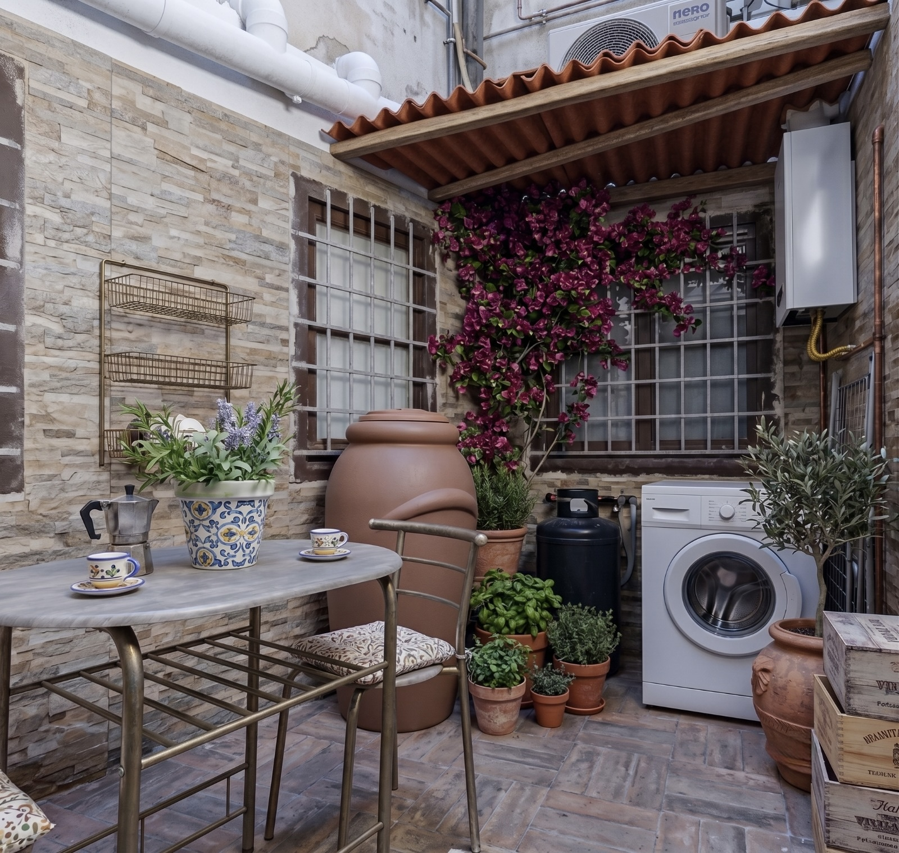

# ☀️ Sicily Guest House • Palermo

Sito vetrina moderno, responsive ed elegante per **Sicily Guest House**, un accogliente affittacamere situato nel centro storico di Palermo (Via Pietro D'Aragona 6, 90127 Palermo).



---

## 🚀 Live Demo

Il sito è pubblicato e raggiungibile gratuitamente su GitHub Pages:  
👉 **[https://maybegem.github.io/sicily-guest-house/](https://maybegem.github.io/sicily-guest-house/)**

---

## ✨ Caratteristiche Principali

- **📅 Calendario Unico a Intervallo (Range DatePicker):**
  L'utente seleziona con un solo tocco sia la data di **Check-in** che di **Check-out**. Il sistema evidenzia l'intervallo di soggiorno e calcola automaticamente il numero di notti.

- **💬 Prenotazione Diretta su WhatsApp:**
  Nessun motore di prenotazione complesso. Cliccando su *"Richiedi su WhatsApp"*, si apre direttamente una chat pre-compilata con date, numero di ospiti, notti calcolate e tipologia di camera.

- **📸 Galleria Fotografica con Lightbox:**
  Immagini ad alta risoluzione degli ambienti (Terrazza Solarium, Camera Matrimoniale Classic, Camera Doppia Twin, Cucina Condivisa, Bagno Moderno) con ingrandimento a tutto schermo.

- **🎨 Design System Mediterraneo:**
  Palette ispirata ai toni caldi della Sicilia: Terracotta Sfumato (`#D96B43`), Ottanio Mediterraneo (`#2E8B9A`), Lino Naturale (`#FAF8F5`) e Verde WhatsApp (`#25D366`).

- **📱 Mobile-First & Responsive:**
  Perfettamente ottimizzato per smartphone, tablet e desktop.

- **📍 Posizione Strategica & Mappa:**
  Indicazione dei principali monumenti raggiungibili a piedi (Cattedrale 1 km, Fontana Pretoria 1.1 km, Ballarò e Il Capo) e collegamento diretto con Google Maps.

---

## 🛠️ Tecnologie Utilizzate

- **HTML5** semantico ed essenziale
- **CSS3** (Custom Properties, Flexbox, CSS Grid, Media Queries)
- **JavaScript ES6+** vanilla (gestione dinamica di WhatsApp e modali)
- **[Flatpickr](https://flatpickr.js.org/)** (libreria leggera per il calendario range in italiano)
- **FontAwesome 6** (iconografia vettoriale)
- **Google Fonts** (*Outfit* per i titoli + *Plus Jakarta Sans* per il testo)

---

## 📂 Struttura del Progetto

```text
sicily-guest-house/
├── assets/
│   ├── terrazzo.jpg    # Foto Terrazza Solarium
│   ├── letto.jpg       # Foto Camera Matrimoniale
│   ├── letto2.jpg      # Foto Camera Doppia / Twin
│   ├── cucina.jpg      # Foto Cucina Attrezzata
│   └── bagno.jpg       # Foto Bagno Moderno
├── index.html          # Struttura principale della pagina
├── style.css           # Foglio di stile personalizzato
├── app.js              # Logica JavaScript e integrazione WhatsApp
└── README.md           # Documentazione del progetto
